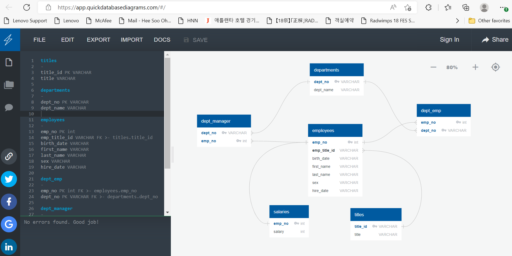

# sql_challenge

## Purpose of Project
In this assignment, you will design the tables to hold data in the CSVs, import the CSVs into a SQL database, and answer questions about the data. In other words, you will perform data modeling, data engineering, and data analysis.

In this assignment requires the application of SQl concepts using CSV files to answer questions and peform data modeling, data engineering, and data analysis.

### Data Modeling
Check all CSV files and create ERD using http://www.quickdatabasediagrams.com.
See below for the ERD of the tables.

### Data Engineering
Specified data types. Created primary keys and a unique column. Created foreign keys and composite key for a unique row. Imported each CSV file into the corresponding SQL table.

### Data Analysis
Once you have a complete database, perform these steps:
1. List the following details of each employee: employee number, last name, first name, sex, and salary.
2. List first name, last name, and hire date for employees who were hired in 1986.
3. List the manager of each department with the following information: department number, department name, the manager's employee number, last name, first name.
4. List the department of each employee with the following information: employee number, last name, first name, and department name.
5. List first name, last name, and sex for employees whose first name is "Hercules" and last names begin with "B."
6. List all employees in the Sales department, including their employee number, last name, first name, and department name.
7. List all employees in the Sales and Development departments, including their employee number, last name, first name, and department name.
8. List the frequency count of employee last names (i.e., how many employees share each last name) in descending order.

## Analysis 
By analyzing the report, followings found:
1. Most common salary ranges are $40,000 ~ and the least is about $120,000.
2. Average salary for senior staff and staff are little less than $60,000.

## Recommandation 
This founding can be present to HR, Board members to use for wage discussion and more.